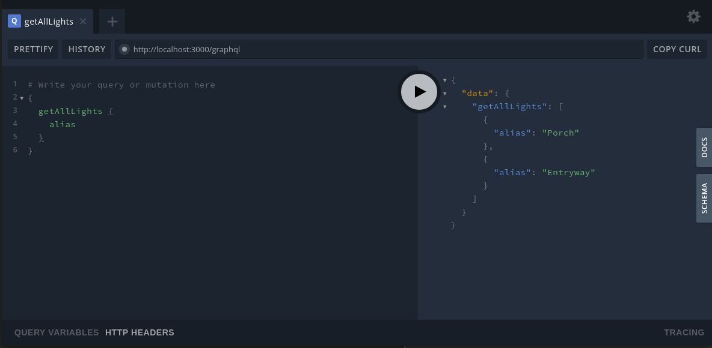

# tplink-graphql

This will make a GraphQL server for controlling and looking in on all the TPLink lights on your local network.

Here is the [API docs](api.md).



## getting started

* [Download](https://github.com/konsumer/tplink-graphql/archive/master.zip) this project
* `npm i`
* `npm start`
* visit your [graphql console](http://localhost:3000/playground)

## colors

I am using [Chromath](https://github.com/jfsiii/chromath) for colors, so you can use any of these strings for `color` value:

```
'#FF0000'                  // Hex (6 characters with hash)
'FF0000'                   // Hex (6 characters without hash)
'#F00'                     // Hex (3 characters with hash)
'F00'                      // Hex (3 characters without hash)
'red'                      // CSS/SVG Chromath name
'rgb(255, 0, 0)'           // RGB via CSS
'rgba(255, 0, 0, 1)'       // RGBA via CSS
'hsl(0, 100%, 50%)'        // HSL via CSS
'hsla(0, 100%, 50%, 1)'    // HSLA via CSS
'hsv(0, 100%, 100%)'       // HSV via CSS
'hsva(0, 100%, 100%, 1)'   // HSVA via CSS
'hsb(0, 100%, 100%)'       // HSB via CSS
'hsba(0, 100%, 100%, 1)'   // HSBA via CSS
```
